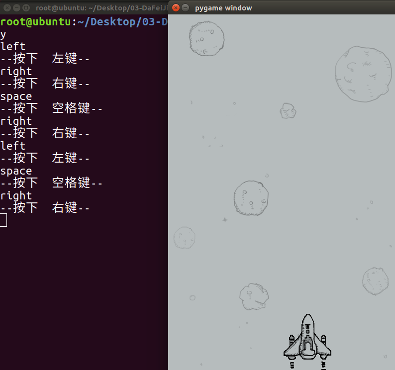

# 打飞机代码4：按键调用飞机方法



```python
#coding=utf-8

'''
	4. 当按下：左键、右键、空格 时让飞机相应的方法调用
'''

import pygame

#导入按键的检测
from pygame.locals import *

import time


#创建玩家的飞机类
class PlayerPlane(object):

	#初始化方法，完成飞机的默认设置
	def __init__(self):

		#导弹的发射时间间隔(单位为:s)
		self.bulletSleepTime = 1
		self.lastShootTime = time.time()
		
		#存储子弹列表
		self.bulletList = []
		
		#飞机图片
		planeImageName = './feiji/hero.gif'
		self.image = pygame.image.load(planeImageName).convert()

		#设置默认的坐标(左上角为(0,0))
		self.x = 230
		self.y = 600

		#设置速度
		self.speed = 5

		#设置飞机名字
		self.planeName = 'player'

	#将飞机显示(画)出来
	def draw(self, screen):
		screen.blit(self.image, (self.x, self.y))

	#键盘按键的处理方法
	def keyHandle(self, keyValue):
		if keyValue=='left':
			print("--按下　左键--")
		elif keyValue == 'right':
			print("--按下　右键--")
		elif keyValue == 'space':
			print("--按下　空格键--")

if __name__ == '__main__':

	screen = pygame.display.set_mode((480,890),0,32)

	bgImageFile = './feiji/background.png'

	background = pygame.image.load(bgImageFile).convert()


	#创建玩家对象
	player = PlayerPlane()

	while True:
		screen.blit(background,(0,0))

		#判断是否是点击了退出按钮
		for event in pygame.event.get():
			# print(event.type)
			if event.type == QUIT:
				print("exit")
				exit()
			elif event.type == KEYDOWN:
				if event.key == K_a or event.key == K_LEFT:
					print('left')
					player.keyHandle('left')

				
				elif event.key == K_d or event.key == K_RIGHT:
					print('right')
					player.keyHandle('right')

				elif event.key == K_SPACE:
					print('space')
					player.keyHandle('space')


		player.draw(screen)


		pygame.display.update()

```